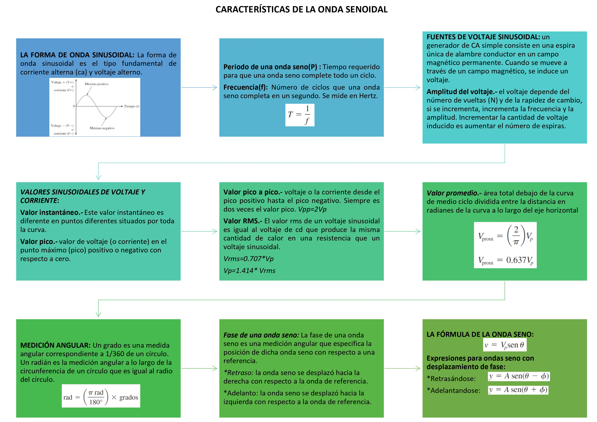

# Informe 6
Informe de laboratorio 6
1. OBJETIVOS 

• Determinar experimentalmente las características de señales senoidales a la vez diferenciar el tipo de corrientes a utilizar en la practica de laboratorio, la corriente alterna.  Reconocer y diferenciarla de la corriente continua, sus valores fundamentales en forma de onda, los cuales serán proporcionados mediante el  multímetro y el osciloscopio.    

• Calcular y medir los valores característicos de un forma de onda alterna.

• Adquirir destreza en el manejo adecuado del osciloscopio

• Conocer el manejo del generador de funciones. 

2.MARCO TEÓRICO

Se denomina corriente alterna (ca) a la corriente eléctrica en la que la magnitud y dirección varían periódicamente. La forma de onda de la corriente alterna más
comúnmente utilizada es la de una onda senoidal, puesto que se consigue una transmisión más eficiente de la energía.

3. DIAGRAMAS

Diagrama  general (circuito)

Circuito armado en Simulador DCAClab

Circuito  en el cual el osciloscopio esta conectado a RL

Circuito  en el cual el multimetro esta conectado a RL

4. LISTA DE COMPONENTES

5. EXPLICACIÓN 

Responda las siguientes preguntas: 
 
•	¿Cuántas divisiones por cuadro abarca la amplitud pico de la señal de salida? 

Tiene aproximadamente 2.3 divisiones por cuadro

•	¿En qué valor está posicionada la perilla VOLTS/DIV?

Está posicionada en el valor de 3 

•	¿Cuántas divisiones por cuadro abarca un ciclo completo de la señal de salida? 

El ciclo completo abarca 4.6 cuadros aproximadamente

•	¿En qué valor está posicionada la perilla TIME/DIV?  

Está posicionada en el valor de 0.1ms

•	¿Cuál es la amplitud de voltaje y el periodo de la señal que aparece en la pantalla del osciloscopio? 

La amplitud de voltaje es: 6.83 V

El periodo tiene un valor de 0.0001 s
 

•	Determine la frecuencia natural (Hz) y la frecuencia angular (rad/s) de la señal de salida. 

La frecuencia natural es de 2500 Hz

La frecuencia angular tiene un valor de 15707.963 (rad/s)
 

•	Con el multímetro digital mida el voltaje de salida en RL: 

 Nos arrojó un valor de 4.822 V
 
•	Compare el voltaje medido con el multímetro digital y el obtenido en la amplitud                ¿Coinciden? ¿Por qué?

No, coinciden ya que el voltaje que nos da el osciloscopio es un valor pico y el valor que nos muestra nuestro voltímetro es un valor rms pero, si el valor pico que nos da el osciloscopio lo convertimos a valor rms comprobamos que nos da un valor similar con un error muy pequeño.  

6. CONCLUSIONES:

•	Se pudo observar las distintas formas de onda y sus valores, los cuales dependen de la forma de la onda. 
Se aprendió el uso correcto del osciloscopio y el generador de ondas. 

Existen varios valores los cuales se pueden ver con mayor facilidad usando el osciloscopio. 
En este mismo sentido, se pudo evidenciar que las gráficas de la corriente alterna pueden tomar diferentes formas, ya sea de forma cuadrada, triangular, sinusoidal, etc.

• 

• 
 
7. BIBLIOGRAFÍA

• Floyd Thomas L, “Principios de Circuitos Eléctricos”, 8 ed. 2007 .Pearson Educación de México, S.A. de C.V. México, pp. 281-333.

• Alulema Darwin (2020). Capítulo 6. Teorema de Thevenin. Pags 48-55. 

• Teorema de Thévenin. 2017. Ecured. Recuperado de: https://www.ecured.cu/Teorema_de_Thévenin

• Veloso C (2017). TEOREMA DE THÉVENIN – CIRCUITO EQUIVALENTE. Recuperado de https://www.electrontools.com/Home/WP/teorema-de-thevenin-circuito-equivalente/

8. Anexos

